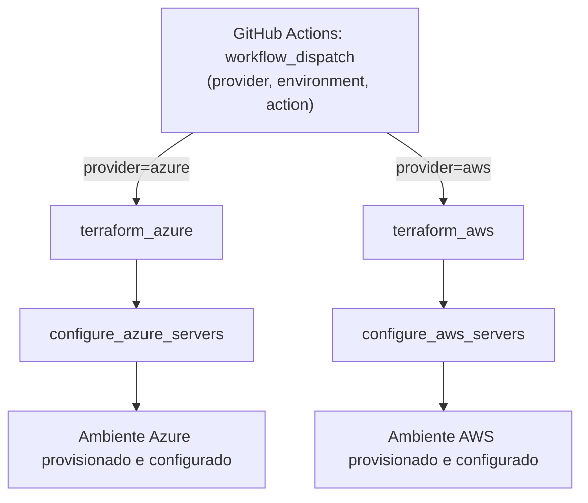
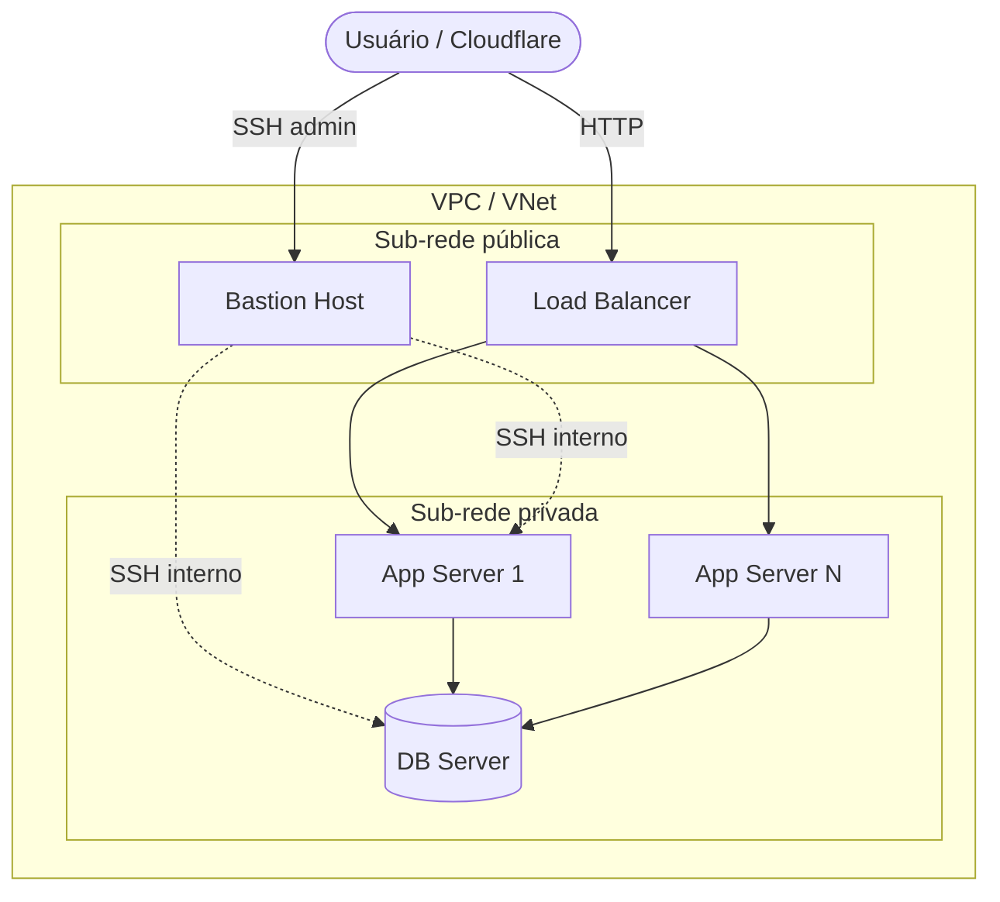

# Framework de Automação de Infraestrutura Multi-Cloud - TCC

**Um framework robusto, baseado em Infraestrutura como Código (IaC), para o provisionamento e configuração ágil e segura de ambientes de aplicação na nuvem.**

---


## 📖 Resumo do Projeto

Este repositório contém o Trabalho de Conclusão de Curso (TCC) para o curso de Análise e Desenvolvimento de Sistemas da Fatec. O projeto ataca uma "dor" de mercado crítica: a lentidão, o custo elevado e a inconsistência associados ao provisionamento manual de infraestrutura de TI.

A solução é um framework de automação que utiliza as melhores práticas de mercado (DevOps, IaC) para criar ambientes de aplicação completos (Teste, Homologação e Produção) de forma 100% automatizada, garantindo agilidade, segurança e consistência entre eles.

## 🏛️ Arquitetura da Solução (Multi-Cloud: AWS & Azure)

### Visão geral do pipeline



### Topologia de rede por ambiente

O mesmo desenho de 6 módulos é aplicado em cada ambiente (teste/homol/prod), em ambos os provedores:



A infraestrutura é provisionada de forma equivalente em **AWS** e **Azure**, cada uma
seguindo o mesmo design de 6 módulos (networking, security, data_storage,
app_environment, bastion, load_balancer). AWS e Azure **não** compartilham código —
`modules/aws/*` e `modules/azure/*` são implementações paralelas e independentes do
mesmo desenho, escolhidas via input `provider` no pipeline. Cada ambiente é
distribuído em múltiplas Zonas de Disponibilidade. Os componentes principais são:

* **Rede (VPC/VNet):** Uma rede customizada com sub-redes públicas (para recursos de
  front-end como Load Balancer e Bastion Host) e privadas (para recursos de back-end
  como servidores de aplicação e banco de dados), garantindo o isolamento da camada
  de dados.
* **Computação (EC2/VM):** A arquitetura é composta por instâncias de computação para:
    * **Bastion Host:** Ponto de entrada seguro para acesso administrativo.
    * **Servidor(es) de Aplicação:** Onde a aplicação principal é executada.
    * **Servidor de Banco de Dados:** Isolado na rede privada para máxima segurança.
* **DNS público (Cloudflare):** O DNS público (aplicação e Bastion) é gerenciado pelo
  provider **Cloudflare**, com proxy habilitado para a aplicação — é na Cloudflare
  que o SSL/TLS é terminado, não no Load Balancer.
* **DNS privado (Route 53 / Azure Private DNS):** Resolve nomes internos
  (`db-server`, `app-server-N`) para comunicação entre os servidores, sem tráfego
  saindo para a internet pública.
* **Segurança (Security Groups / NSGs):** Regras de firewall granulares que seguem o
  princípio do menor privilégio, referenciando-se por ID (não por CIDR aberto) entre
  bastion, load balancer e camada de aplicação/banco.
* **Balanceamento de Carga (ALB / Application Gateway):** Ponto de entrada único
  para a aplicação, recebendo tráfego HTTP já descriptografado da borda da
  Cloudflare e distribuindo entre os servidores de aplicação, que servem a
  aplicação através de um container Nginx. Ambos operam em Camada 7 (roteamento
  por requisição HTTP, não por conexão TCP), garantindo distribuição real de
  carga entre réplicas em ambas as clouds.

## 🛠️ Tecnologias Utilizadas

* **Terraform:** Para a declaração da infraestrutura como código (IaC).
* **Ansible:** Para o gerenciamento de configuração pós-provisionamento — instalação
  de Docker e Docker Compose, padronização de hostname entre os provedores e deploy
  de um container Nginx (`playbook_docker.yml` e `playbook_nginx_container.yml`).
* **GitHub Actions:** Como plataforma de orquestração e CI/CD para automação do fluxo de trabalho.
* **AWS (Amazon Web Services) & Azure:** Como provedores de nuvem, com ambientes equivalentes em ambos.
* **Cloudflare:** Para DNS público e terminação de SSL/TLS.
* **Git & GitFlow:** Para versionamento de código e estratégia de branches.

## 📁 Estrutura do Repositório

O projeto é organizado de forma modular para máxima reutilização e clareza:

```bash
├── .github/workflows/    # Contém o pipeline de CI/CD (GitHub Actions)
├── ansible/              # Contém os playbooks de configuração do Ansible
├── backend/              # Bootstrap único do state remoto (S3+DynamoDB / Storage Account)
│   ├── aws/
│   └── azure/
├── docs/                 # Documentação de apoio (acessos administrativos, anteprojeto)
├── environments/         # Onde a infraestrutura é efetivamente executada
│   ├── aws/
│   │   ├── teste/        # Ambiente de Teste (AWS)
│   │   ├── homol/        # Ambiente de Homologação (AWS)
│   │   └── prod/         # Ambiente de Produção (AWS)
│   └── azure/
│       ├── teste/        # Ambiente de Teste (Azure)
│       ├── homol/        # Ambiente de Homologação (Azure)
│       └── prod/         # Ambiente de Produção (Azure)
├── modules/              # Blocos de construção reutilizáveis da infraestrutura
│   │                     # (cada módulo traz main/variables/outputs/versions.tf +
│   │                     #  README.md gerado via terraform-docs)
│   ├── aws/
│   │   ├── networking/       # VPC, sub-redes públicas/privadas
│   │   ├── security/         # Security Groups
│   │   ├── data_storage/     # Volume persistente do banco de dados
│   │   ├── app_environment/  # Servidor(es) de aplicação + banco de dados
│   │   ├── bastion/          # Bastion Host
│   │   └── load_balancer/    # Application Load Balancer
│   └── azure/
│       ├── networking/       # VNet, subnets públicas/privadas
│       ├── security/         # NSGs
│       ├── data_storage/     # Managed Disk do banco de dados
│       ├── app_environment/  # Servidor(es) de aplicação + banco de dados
│       ├── bastion/          # Bastion Host
│       └── load_balancer/    # Application Gateway (L7)
└── ...
```

## 🚀 Como Usar o Framework

Todo o ciclo de vida da infraestrutura (criação e destruição) é gerenciado exclusivamente pelo pipeline do GitHub Actions.

1.  Navegue até a aba **"Actions"** no repositório do GitHub.
2.  Na lista de workflows à esquerda, selecione **"Orquestrador Multicloud TCC (Azure & AWS)"**.
3.  Clique no botão **"Run workflow"**.
4.  Selecione a **branch** que contém o código a ser executado.
5.  No menu **"Provedor de Nuvem"**, escolha `azure` ou `aws`.
6.  No menu **"Ambiente"**, escolha o ambiente desejado (`teste`, `homol` ou `prod`).
7.  No menu **"Ação"**, escolha `apply` (para criar/atualizar), `destroy` (para destruir) ou `force-unlock` (para liberar um state lock preso, informando o `Lock ID`).
8.  Clique no botão verde **"Run workflow"** para iniciar a automação.

## 🔑 Acesso Administrativo

As instruções detalhadas para acessar os ambientes via SSH (através do Bastion Host) estão documentadas no arquivo:

➡️ **[Guia de Acesso Administrativo](./docs/ACESSOS.md)**

## 📄 Documentação Adicional

* **[Anteprojeto](./docs/ANTEPROJETO%20-%20ALISSON%20CORREA%20LIMA.doc)** — documento que descreve o propósito e a motivação acadêmica deste projeto (TCC).
* **[Gates de Qualidade no CI](./docs/CI-QUALIDADE.md)** — por que e como o pipeline de PR passou a rodar tflint, Trivy, verificação de sincronismo do terraform-docs e testes automatizados de módulo (`terraform test`).
* **[Diagramas de Arquitetura](./docs/ARQUITETURA.md)** — split de DNS público/privado e fluxo do pipeline de CI/CD (JIT SSH), em Mermaid.

## 👨‍💻 Autor

* **Alisson Lima**
    * GitHub: `[alisson92](https://github.com/alisson92)`
    * LinkedIn: `https://www.linkedin.com/in/alisson-correa-lima-8404ab233/`
