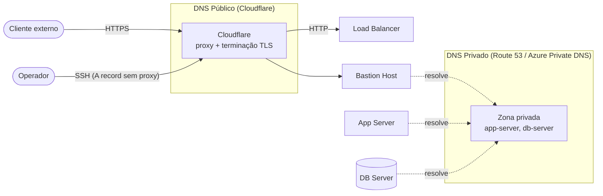
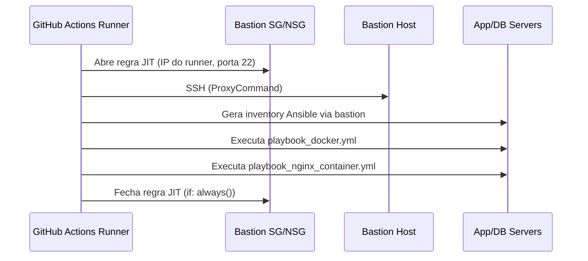

# Arquitetura — Diagramas Complementares

Este documento reúne diagramas de arquitetura que não são específicos de um
único guia (`ACESSOS.md`, `CI-QUALIDADE.md`) nem cabem no resumo do
`README.md`. Complementam a descrição textual já existente no `CLAUDE.md`.

## Split de DNS (público x privado)

O DNS público (Cloudflare) e o DNS privado (Route 53 / Azure Private DNS)
resolvem propósitos diferentes: o primeiro expõe a aplicação e o Bastion à
internet, terminando TLS na borda; o segundo resolve hostnames internos
(`app-server`, `db-server`) para tráfego que nunca sai da rede virtual.

## Fluxo do pipeline de CI/CD (JIT SSH)

Para cada execução (`apply`/`destroy`), o pipeline abre uma regra de SSH
temporária no Security Group/NSG do Bastion, restrita ao IP do runner do
GitHub Actions, e sempre a fecha ao final — mesmo que um passo anterior falhe
(`if: always()`).

## Ver também

- [`CLAUDE.md`](../CLAUDE.md) — descrição textual completa da arquitetura, camadas de módulo e convenções.
- [`docs/ACESSOS.md`](./ACESSOS.md) — guia de acesso administrativo via SSH (inclui o diagrama do modelo de acesso).
- [`docs/CI-QUALIDADE.md`](./CI-QUALIDADE.md) — gates de qualidade do pipeline de PR.
